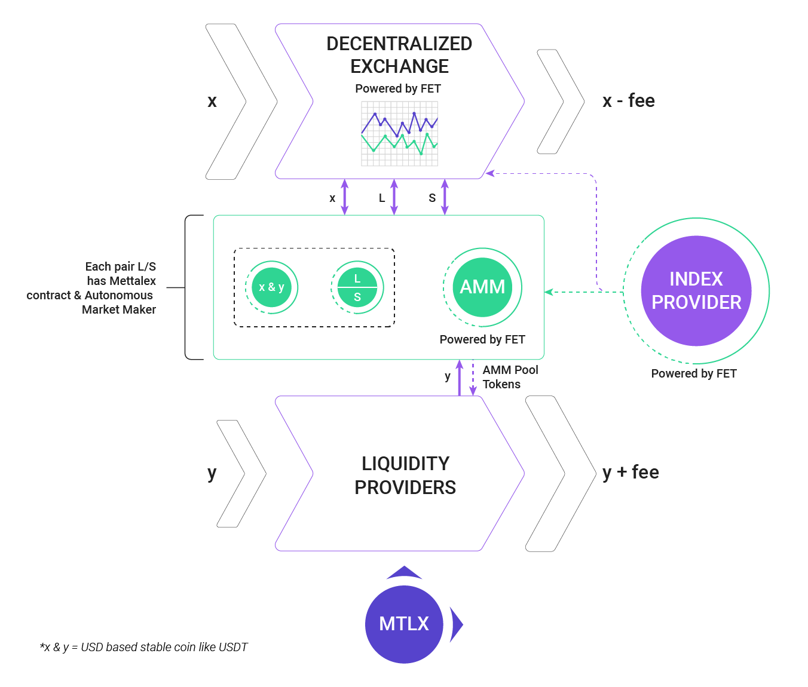

# Mettalex DEX
The Mettalex Decentralised Exchange (DEX) consists of several distinct layers:

* liquidity provision - this makes use of [audited contracts from the yearn ecosystem](https://github.com/iearn-finance/yearn-audits)
* decentralised exchange - this makes use of [audited contracts from the Balancer ecosystem](https://docs.balancer.finance/protocol/security/audits) together with a [Mettalex Pool Controller](on-chain/pool-controller/contracts/StrategyBalancerMettalexV2.sol) acting as a smart pool
* [Mettalex vault](on-chain/mettalex-vault/contracts/vault/Vault.sol) - this stores the collateral acting backing the position tokens 

The [Mettalex vault](on-chain/mettalex-vault/contracts/vault/Vault.sol) allows traders and market makers to mint pairs of long and short position tokens by locking collateral.  It also allows redemption of a long and short pair for the underlying collateral.

The on-chain market maker allows traders to enter/exit a single-sided position without going through
the "mint pair and sell one side" flow.

The market maker itself is a  [Mettalex Pool Controller](on-chain/pool-controller/contracts/StrategyBalancerMettalexV2.sol) contract 
that makes use of a private [Balancer](https://balancer.finance) pool internally
to set position token prices in line with the underlying asset price.




# Hackathon: Open DeFi Hackathon
*WORK IN PROGRESS*
## Launching The Mettalex DEX On Multiple Blockchains

#### ~/.mettalex/config-dev.json

```
{
  "admin": {
    "key": "PRIV-KEY",
    "harmony-key": "HARMONY-NETWORK-PRIV-KEY"
  },
  "infura": {
    "project_id": "INFURA-PROJECT-ID",
    "secret": "INFURA-SECRET"
  }
}
```


### Polygon(matic) Network
*python3 mettalex_contract_setup.py -a setup -n polygon-testnet -v 3*

```
Deploying contracts
Whitelisting Mettalex vault to mint position tokens
Long Position whitelist state for 0x501b6548B6A47152Be1F1d95077516C4F3C78027 changed from False to True
Short Position whitelist state for 0x501b6548B6A47152Be1F1d95077516C4F3C78027 changed from False to True
Setting strategy
Tether USD strategy changed from 0x0000000000000000000000000000000000000000 to 0x1a1Cb7FbcE60Aa1BE616883255792505bA588088
Setting y-vault controller
yVault added in yController
Setting balancer controller
Balancer controller 0x1a1Cb7FbcE60Aa1BE616883255792505bA588088
Setting Mettalex vault AMM
Mettalex Vault strategy changed from 0x6056eD0A67FaE0decc28faA5616BB1002beDA07C to 0x1a1Cb7FbcE60Aa1BE616883255792505bA588088
Mettalex Vault spot changed from 0 to 2500

Y Vault (0xF72420c5EB5e0301007b792d171479fa603f2c65) has 0.00 vault shares
  0.00 coin, 0.00 LTK, 0.00 STK
```

### Harmony Network
*python3 mettalex_contract_setup.py -a setup -n harmony-testnet -v 3*

```
Deploying contracts
Whitelisting Mettalex vault to mint position tokens
Long Position whitelist state for 0xfAd2b7c4E893f9519AB71940D5bE1dD143904283 changed from False to True
Short Position whitelist state for 0xfAd2b7c4E893f9519AB71940D5bE1dD143904283 changed from False to True
Setting strategy
Tether USD strategy changed from 0x0000000000000000000000000000000000000000 to 0x9e044aac6efdBf94f54A4871c1f42230F733a35C
Setting y-vault controller
yVault added in yController
Setting balancer controller
Balancer controller 0x9e044aac6efdBf94f54A4871c1f42230F733a35C
Setting Mettalex vault AMM
Mettalex Vault strategy changed from 0x338F3D09a6093a68E3A96C2497C09fc4F1fc80fe to 0x9e044aac6efdBf94f54A4871c1f42230F733a35C
Mettalex Vault spot changed from 0 to 2500

Y Vault (0x423EE462EF3c8a9e75721743632dFf642F3d32BE) has 0.00 vault shares
  0.00 coin, 0.00 LTK, 0.00 STK
```

### Avalanche Network
*python3 mettalex_contract_setup.py -a setup -n avalanche-testnet -v 3*

```
Deploying contracts
Whitelisting Mettalex vault to mint position tokens
Long Position whitelist state for 0x501b6548B6A47152Be1F1d95077516C4F3C78027 changed from False to True
Short Position whitelist state for 0x501b6548B6A47152Be1F1d95077516C4F3C78027 changed from False to True
Setting strategy
Tether USD strategy changed from 0x0000000000000000000000000000000000000000 to 0x1a1Cb7FbcE60Aa1BE616883255792505bA588088
Setting y-vault controller
yVault added in yController
Setting balancer controller
Balancer controller 0x1a1Cb7FbcE60Aa1BE616883255792505bA588088
Setting Mettalex vault AMM
Mettalex Vault strategy changed from 0x6056eD0A67FaE0decc28faA5616BB1002beDA07C to 0x1a1Cb7FbcE60Aa1BE616883255792505bA588088
Mettalex Vault spot changed from 0 to 2500

Y Vault (0xF72420c5EB5e0301007b792d171479fa603f2c65) has 0.00 vault shares
  0.00 coin, 0.00 LTK, 0.00 STK
```

### OKExChain Network
*Currently investigating to fix a error when "Setting balancer controller" function is called*
```
ValueError: {'code': -32000, 'message': 'contract address collision: failed to execute message; message index: 0: failed to simulate tx'}
```

*python3 mettalex_contract_setup.py -a setup -n okexchain-testnet -v 3*

```
Deploying contracts
Whitelisting Mettalex vault to mint position tokens
Long Position whitelist state for 0x2ebad5AFA4275aD889A4B70d9866F7d83CFa66C8 changed from False to False
Short Position whitelist state for 0x2ebad5AFA4275aD889A4B70d9866F7d83CFa66C8 changed from False to True
Setting strategy
Tether USD strategy changed from 0x0000000000000000000000000000000000000000 to 0xc5bB7DaD9381f00Bb2FC232b041a02AEa62b16b1
Setting y-vault controller
yVault added in yController
Setting balancer controller
- Contract Address None
- Strategy Address 0xc5bB7DaD9381f00Bb2FC232b041a02AEa62b16b1
Setting Mettalex vault AMM
Mettalex Vault strategy changed from 0xA4eacd0162Ca8aa5447ae6a29230a9B7F032A5AA to 0xc5bB7DaD9381f00Bb2FC232b041a02AEa62b16b1
Mettalex Vault spot changed from 0 to 2500

Y Vault (0xF25B3902112a7DE43B72498012BEAf55CfA0C643) has 0.00 vault shares
  0.00 coin, 0.00 LTK, 0.00 STK
```

### Changelog

- 05-05-2021 - Added Polygon(matic) Mainnet and Testnet deploy support to "mettalex_contract_setup.py" script

- 05-05-2021 - Added Harmony Mainnet and Testnet deploy support to "mettalex_contract_setup.py" script

- 05-05-2021 - Added Avalanche Mainnet and Testnet deploy support to "mettalex_contract_setup.py" script

- 05-05-2021 - Added "harmony-key" to ~/.mettalex/config-dev.json to enable harmony network integration

- 05-05-2021 - OKExChain Error
```
Deploying contracts
Traceback (most recent call last):
  File "mettalex_contract_setup.py", line 1094, in <module>
    w3, admin, deployed_contracts = full_setup(
  File "mettalex_contract_setup.py", line 509, in full_setup
    deployed_contracts = deploy(w3, contracts)
  File "mettalex_contract_setup.py", line 326, in deploy
    balancer = create_balancer_pool(w3, contracts['BPool'], balancer_factory)
  File "mettalex_contract_setup.py", line 403, in create_balancer_pool
    pool_address = receipt[0]['args']['pool']
IndexError: tuple index out of range
```

07-05-2021 - OKExChain Error - When "Setting balancer controller" function is called
```
ValueError: {'code': -32000, 'message': 'contract address collision: failed to execute message; message index: 0: failed to simulate tx'}
```